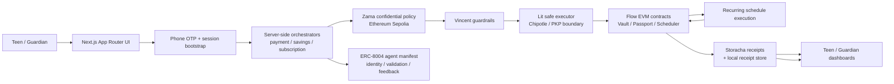
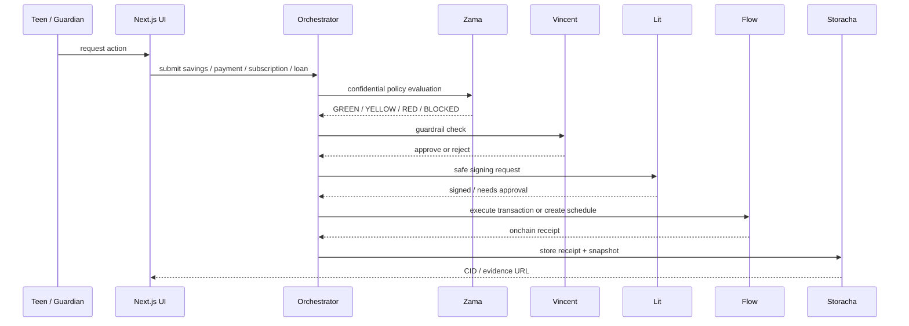

# OnlyTeens

OnlyTeens is a teen-focused crypto finance product that helps teenagers use digital money safely, with guardian oversight, private household rules, AI explanations, and receipts for every meaningful action.

The product is built for the reality that teens can use crypto, but most do not because they:

- do not understand wallets, keys, signing, gas, or recurring onchain actions
- are afraid of making mistakes
- need guidance before money moves
- need a guardian to set and enforce limits

OnlyTeens turns crypto into a supervised learning and usage experience.

## What OnlyTeens Is

OnlyTeens is a guided crypto finance system for teens and families.

It gives:

- a teen workspace for savings, subscriptions, and approved actions
- a guardian workspace for rules, approvals, and oversight
- an AI assistant called `Clawrence` that explains actions in plain language
- private policy checks before execution
- bounded delegated execution
- receipts and evidence after execution

The goal is simple:

> Teens should learn crypto by doing, while guardians stay in control of risk and limits.

## Problem Statement

Today, teens are digitally native, but crypto products are still too technical for them.

The main issues are:

- wallet creation is confusing
- gas fees and signing are not understandable
- parents cannot set clear guardrails
- there is no trust-building journey for teens
- there is no simple explanation layer before money moves

So the gap is not access to crypto.
The gap is safe understanding, guided action, and family trust.

## Product Vision

OnlyTeens is building a crypto training-wheels system for teens.

Instead of giving a teen a raw wallet and hoping they do not make mistakes, the app creates a controlled environment where they can:

- learn by doing
- build trust over time
- get access to more freedom as they prove responsibility

## Core User Story

> A teen wants to start using crypto for savings and digital subscriptions, but does not know how to do it safely. A guardian wants to allow learning and controlled usage without giving full unrestricted access.

OnlyTeens responds with:

- a teen workspace for saving, subscriptions, and guided actions
- a guardian workspace for rules, approvals, and oversight
- an AI guide that explains what is happening in plain language
- private policy checks before execution
- onchain proof and receipts after execution

## Core Roles

### Teen

- requests actions like savings or subscriptions
- interacts through a consumer-style interface
- gets explanations before and after actions
- builds a trust profile over time

### Guardian

- creates the family setup
- defines household policy and spending limits
- reviews risky or recurring actions
- can approve, reject, pause, or change permissions

### AI Assistant

In the current codebase the assistant is called `Clawrence`, and some execution surfaces refer to the `Calma` lane.

Its job is to:

- explain requests in simple language
- help teens understand the action
- help guardians review requests
- stay inside bounded permission rules

## What the Product Actually Does

OnlyTeens currently supports these main features:

- family onboarding
- guardian and teen authentication
- teen savings actions
- teen subscription requests
- guardian approval inbox
- confidential household policy evaluation
- bounded delegated execution
- recurring scheduling
- teen trust/passport progression
- evidence receipts and activity history

## Architecture





## Sponsor / Infra Split

### Flow

Flow is the execution chain for user-facing financial actions.

Used for:

- savings deposits
- subscription reserve funding
- subscription payments
- scheduling
- passport-related onchain state

### Zama

Zama is used for confidential policy evaluation.

Used for:

- private household rules
- action evaluation without exposing raw policy values publicly
- classification into outcomes like `GREEN`, `YELLOW`, `RED`, or `BLOCKED`

### Lit

Lit is used for bounded delegated execution.

Used for:

- safe executor permissions
- controlled signing flow
- preventing unrestricted agent execution

### Vincent

Vincent acts as a guardrail and execution safety layer.

Used for:

- extra review before execution
- checking whether the action should proceed
- improving trust around AI-assisted execution

### Storacha

Storacha is used as the evidence layer.

Used for:

- receipts
- proof records
- approval records
- activity artifacts

## Track-by-Track Code References

| Track | Why OnlyTeens fits | Code references |
|---|---|---|
| Protocol Labs: Community Vote Bounty | Proof, receipts, and shareable audit trails are first-class features. | [src/lib/storacha/receipts.ts](src/lib/storacha/receipts.ts), [src/lib/receipts/receiptStore.ts](src/lib/receipts/receiptStore.ts), [src/components/ActivityFeed.tsx](src/components/ActivityFeed.tsx), [src/components/ReceiptCard.tsx](src/components/ReceiptCard.tsx), [src/app/guardian/activity/page.tsx](src/app/guardian/activity/page.tsx), [src/app/teen/activity/page.tsx](src/app/teen/activity/page.tsx) |
| Ethereum Foundation: 🔐 Agents With Receipts — 8004 | The app publishes an agent manifest, execution log, validation flow, and feedback hooks. | [src/app/api/agent.json/route.ts](src/app/api/agent.json/route.ts), [src/app/api/agent_log.json/route.ts](src/app/api/agent_log.json/route.ts), [src/app/api/erc8004/register/route.ts](src/app/api/erc8004/register/route.ts), [src/app/api/erc8004/validation/route.ts](src/app/api/erc8004/validation/route.ts), [src/app/api/erc8004/feedback/route.ts](src/app/api/erc8004/feedback/route.ts), [src/lib/erc8004/client.ts](src/lib/erc8004/client.ts) |
| Zama: Zama: Confidential Onchain Finance | Household policy is evaluated with confidential thresholds and hidden decision logic. | [contracts/Proof18Policy.sol](contracts/Proof18Policy.sol), [src/lib/zama/client.ts](src/lib/zama/client.ts), [src/lib/zama/policy.ts](src/lib/zama/policy.ts), [src/lib/zama/decrypt.ts](src/lib/zama/decrypt.ts), [src/app/api/policy/evaluate/route.ts](src/app/api/policy/evaluate/route.ts), [src/app/api/policy/set/route.ts](src/app/api/policy/set/route.ts) |
| Lit Protocol: Lit Protocol: NextGen AI Apps | Clawrence is constrained by a safe executor boundary and permission-aware execution metadata. | [src/lib/lit/executor.ts](src/lib/lit/executor.ts), [src/lib/lit/permissions.ts](src/lib/lit/permissions.ts), [src/lib/lit/viemAccount.ts](src/lib/lit/viemAccount.ts), [src/lib/lit/client.ts](src/lib/lit/client.ts), [src/lib/clawrence/engine.ts](src/lib/clawrence/engine.ts), [src/lib/lit/chipotle.ts](src/lib/lit/chipotle.ts) |
| Protocol Labs: Fresh Code | This is a custom-built product with its own orchestration, contracts, receipts, and agent surfaces. | [src/app](src/app), [src/lib/orchestration](src/lib/orchestration), [contracts](contracts), [src/lib/storacha](src/lib/storacha), [src/lib/receipts](src/lib/receipts) |
| Protocol Labs: Crypto | The app manages wallets, balances, settlement, approvals, and proof-bearing value transfer. | [src/lib/flow/vault.ts](src/lib/flow/vault.ts), [src/lib/flow/passport.ts](src/lib/flow/passport.ts), [src/lib/flow/scheduler.ts](src/lib/flow/scheduler.ts), [contracts/Proof18Vault.sol](contracts/Proof18Vault.sol), [contracts/Proof18Scheduler.sol](contracts/Proof18Scheduler.sol) |
| Flow: Flow: The Future of Finance | Value moves on Flow, recurring actions are scheduled, and the UX is consumer-finance-first. | [src/lib/flow](src/lib/flow), [src/lib/orchestration/savingsFlow.ts](src/lib/orchestration/savingsFlow.ts), [src/lib/orchestration/subscriptionFlow.ts](src/lib/orchestration/subscriptionFlow.ts), [src/lib/orchestration/paymentFlow.ts](src/lib/orchestration/paymentFlow.ts), [src/app/teen](src/app/teen), [src/app/guardian](src/app/guardian) |

## End-to-End Flows

### 1. Family setup

1. Guardian starts onboarding.
2. Teen is linked to the family.
3. Family record is created.
4. Roles, wallets, and execution context are prepared.
5. Guardian and teen get routed to their own dashboards.

### 2. Teen savings action

1. Teen enters a savings request.
2. Clawrence explains the action in simple language.
3. Zama evaluates the policy privately.
4. Vincent guardrails check the action.
5. Lit safe executor decides whether signing is allowed.
6. Flow executes the savings deposit.
7. Passport is updated.
8. Receipt and proof are stored.

### 3. Teen subscription request

1. Teen requests a subscription.
2. Clawrence explains the request.
3. Zama evaluates it privately.
4. If decision is `GREEN`, it can proceed directly.
5. If decision is `YELLOW` or `RED`, guardian approval is required.
6. Guardian reviews the request in the inbox.
7. After approval, execution happens through the bounded signing path.
8. Reserve is funded, schedule is created, and proof is stored.

### 4. Guardian review

1. Guardian opens the approval inbox.
2. Reads action details and AI explanation.
3. Approves or rejects.
4. Decision is stored as evidence.
5. Teen activity history reflects the outcome.

## Main Product Surfaces

- `/auth` - onboarding and session bootstrap
- `/teen` - teen dashboard
- `/guardian` - guardian dashboard
- `/auth/proof` - judge-facing proof surface
- `/teen/pay` - direct payment flow
- `/teen/save` - savings flow
- `/teen/subscribe` - subscription flow
- `/teen/chat` - Clawrence assistant
- `/teen/activity` - receipts and history
- `/guardian/setup` - family setup and rule setup
- `/guardian/activity` - audit and evidence view
- `/api/agent.json` - ERC-8004 agent manifest
- `/api/agent_log.json` - ERC-8004 execution log
- `/api/erc8004/*` - register, validate, and submit feedback

## Smart Contract Layer

- [contracts/Proof18Access.sol](contracts/Proof18Access.sol) - role registry, family activation, teen membership, executor approval
- [contracts/Proof18Vault.sol](contracts/Proof18Vault.sol) - savings, subscription reserve, and loan handling
- [contracts/Proof18Scheduler.sol](contracts/Proof18Scheduler.sol) - recurring execution schedule
- [contracts/Proof18Passport.sol](contracts/Proof18Passport.sol) - teen trust progression and milestones
- [contracts/Proof18Policy.sol](contracts/Proof18Policy.sol) - confidential family policy evaluation

## UI and Product Experience

### Teen experience

- [src/app/teen/page.tsx](src/app/teen/page.tsx) - teen dashboard shell
- [src/app/teen/pay/page.tsx](src/app/teen/pay/page.tsx) - direct payment flow
- [src/app/teen/save/page.tsx](src/app/teen/save/page.tsx) - savings flow
- [src/app/teen/subscribe/page.tsx](src/app/teen/subscribe/page.tsx) - subscription flow
- [src/app/teen/defi/page.tsx](src/app/teen/defi/page.tsx) - DeFi allocation view
- [src/app/teen/chat/page.tsx](src/app/teen/chat/page.tsx) - Clawrence assistant
- [src/app/teen/activity/page.tsx](src/app/teen/activity/page.tsx) - activity history
- [src/app/teen/passport/page.tsx](src/app/teen/passport/page.tsx) - passport progress

### Guardian experience

- [src/app/guardian/page.tsx](src/app/guardian/page.tsx) - guardian dashboard entry
- [src/app/guardian/setup/page.tsx](src/app/guardian/setup/page.tsx) - family setup
- [src/app/guardian/family/page.tsx](src/app/guardian/family/page.tsx) - family overview
- [src/app/guardian/inbox/page.tsx](src/app/guardian/inbox/page.tsx) - approvals inbox
- [src/app/guardian/activity/page.tsx](src/app/guardian/activity/page.tsx) - audit trail

### Shared surfaces

- [src/app/page.tsx](src/app/page.tsx) - landing page
- [src/app/auth/page.tsx](src/app/auth/page.tsx) - onboarding entry
- [src/app/auth/proof/page.tsx](src/app/auth/proof/page.tsx) - proof page
- [src/components/GuardianDashboard.tsx](src/components/GuardianDashboard.tsx) - guardian UI
- [src/components/TeenDashboard.tsx](src/components/TeenDashboard.tsx) - teen UI
- [src/components/ActivityFeed.tsx](src/components/ActivityFeed.tsx) - receipts feed
- [src/components/PassportCard.tsx](src/components/PassportCard.tsx) - passport progress

## Runtime Layers

The app is intentionally layered so each trust boundary is visible:

- [src/lib/auth](src/lib/auth) - phone auth, OTP, and session bootstrap
- [src/lib/flow](src/lib/flow) - Flow account, vault, passport, and scheduler integration
- [src/lib/zama](src/lib/zama) - confidential policy evaluation
- [src/lib/lit](src/lib/lit) - Lit executor, permissions, and account abstraction
- [src/lib/vincent](src/lib/vincent) - AI guardrails and live/fallback detection
- [src/lib/storacha](src/lib/storacha) - receipt and evidence storage
- [src/lib/erc8004](src/lib/erc8004) - identity, validation, and reputation hooks
- [src/lib/receipts](src/lib/receipts) - normalized receipt storage for the UI

## Key Orchestration Files

- [src/lib/orchestration/savingsFlow.ts](src/lib/orchestration/savingsFlow.ts) - savings and goal flows
- [src/lib/orchestration/subscriptionFlow.ts](src/lib/orchestration/subscriptionFlow.ts) - recurring subscriptions and approval routing
- [src/lib/orchestration/paymentFlow.ts](src/lib/orchestration/paymentFlow.ts) - direct payment requests
- [src/lib/orchestration/directFlow.ts](src/lib/orchestration/directFlow.ts) - direct Flow execution path
- [src/lib/orchestration/approvalFlow.ts](src/lib/orchestration/approvalFlow.ts) - guardian approval handling
- [src/lib/orchestration/sharedActions.ts](src/lib/orchestration/sharedActions.ts) - shared metadata and receipt shaping

## Demo Behavior

The app is designed to degrade honestly.

- If Zama live config is missing, policy falls back to explicit degraded behavior.
- If Lit or Chipotle live config is missing, the executor is labeled as local-only.
- If Flow-native scheduling is unavailable, recurring automation falls back to the EVM scheduler.
- If Storacha upload is unavailable, the app still keeps a local receipt trail.
- If ERC-8004 config is missing, the agent manifest still serves locally, but onchain writes are skipped.

That keeps the demo usable while making the trust posture transparent.

## Tech Stack

- **Frontend**: Next.js 15, React 19, TypeScript, Tailwind CSS v4, Framer Motion
- **State**: Zustand
- **Blockchain**: viem, Hardhat, Flow EVM, Ethereum Sepolia
- **Confidential compute**: Zama FHEVM
- **Agent execution**: Lit Protocol, Vincent
- **Evidence**: Storacha
- **Auth**: phone OTP, WebAuthn, session bootstrap
- **Productivity**: OpenAI / OpenRouter-powered assistant flows

## Repository Structure

```text
src/
  app/                Next.js routes and API handlers
  components/         Dashboard, onboarding, and reusable UI
  lib/                Orchestration, chain, auth, evidence, and agent logic
  store/              Zustand stores
  types/              Shared domain types
contracts/            Solidity contracts
data/                 Local demo persistence
```

## Local Setup

### Install

```bash
npm ci
```

### Run

```bash
npm run dev
```

### Build and verify

```bash
npm run typecheck
npm run build
npm run preflight
npm run hardhat:test
```

## Scripts

```bash
npm run dev
npm run build
npm run start
npm run typecheck
npm run preflight
npm run verify
npm run verify:strict
npm run hardhat:compile
npm run hardhat:test
npm run hardhat:deploy:flow
npm run hardhat:deploy:policy
npm run pin:lit-action
```

## Environment Variables

### Flow

- `GAS_FREE_RPC_URL`
- `FLOW_TESTNET_PRIVATE_KEY`
- `NEXT_PUBLIC_ACCESS_CONTRACT`
- `NEXT_PUBLIC_VAULT_CONTRACT`
- `NEXT_PUBLIC_SCHEDULER_CONTRACT`
- `NEXT_PUBLIC_PASSPORT_CONTRACT`
- `NEXT_PUBLIC_POLICY_CONTRACT`

### Zama

- `SEPOLIA_RPC_URL`
- `ZAMA_NETWORK_URL`
- `ZAMA_GATEWAY_URL`
- `ZAMA_KMS_CONTRACT_ADDRESS`
- `ZAMA_ACL_CONTRACT_ADDRESS`

### Lit / Chipotle / executor boundary

- `CHIPOTLE_BASE_URL`
- `CHIPOTLE_ACCOUNT_API_KEY`
- `CHIPOTLE_OWNER_ADDRESS`
- `LIT_MINTING_KEY`
- `SAFE_EXECUTOR_CID`

### Vincent

- `VINCENT_API_KEY`
- `VINCENT_APP_ID`
- `VINCENT_APP_VERSION`
- `VINCENT_REDIRECT_URI`
- `VINCENT_JWT_AUDIENCE`

### ERC-8004

- `CALMA_OPERATOR_PRIVATE_KEY`
- `ERC8004_IDENTITY_REGISTRY_ADDRESS`
- `ERC8004_REPUTATION_REGISTRY_ADDRESS`
- `ERC8004_VALIDATION_REGISTRY_ADDRESS`

### Evidence and assistant

- `STORACHA_KEY`
- `STORACHA_PROOF`
- `OPENROUTER_API_KEY` or `OPENAI_API_KEY`
- `SUBSCRIPTION_RECIPIENT_ADDRESS`
- `PROOF18_LIVE_MODE`
- `PROOF18_ENABLE_EMERGENCY_FALLBACK`

## Deployment Notes

- Deploy or wire the Flow contracts first so the runtime has settlement targets.
- Set the Zama Sepolia addresses before running confidential policy flows in live mode.
- Register the ERC-8004 manifest with [src/app/api/agent.json/route.ts](src/app/api/agent.json/route.ts) and the `agent_log` endpoint.
- Keep `SAFE_EXECUTOR_CID` pinned so the Lit-safe execution surface is stable.

## Hackathon Summary

If you need a short explanation for the submission form, use this:

> OnlyTeens is a guided crypto finance app for teens on Flow. Guardians set safe limits, Clawrence explains each action, Zama evaluates private household policy, Lit bounds delegated execution, ERC-8004 publishes the agent as a receipted identity, and Storacha stores proof for every important action.

## Why This Is Fresh Code

This repo is not a thin wrapper around a starter template.

It includes:

- custom Solidity contracts
- custom orchestration flows
- custom receipts and evidence models
- custom agent manifest and validation endpoints
- custom guardian and teen product surfaces
- custom fallback logic for honest demo behavior

That makes it suitable for the **Fresh Code** track as well as the more specific sponsor tracks.

## License

MIT
