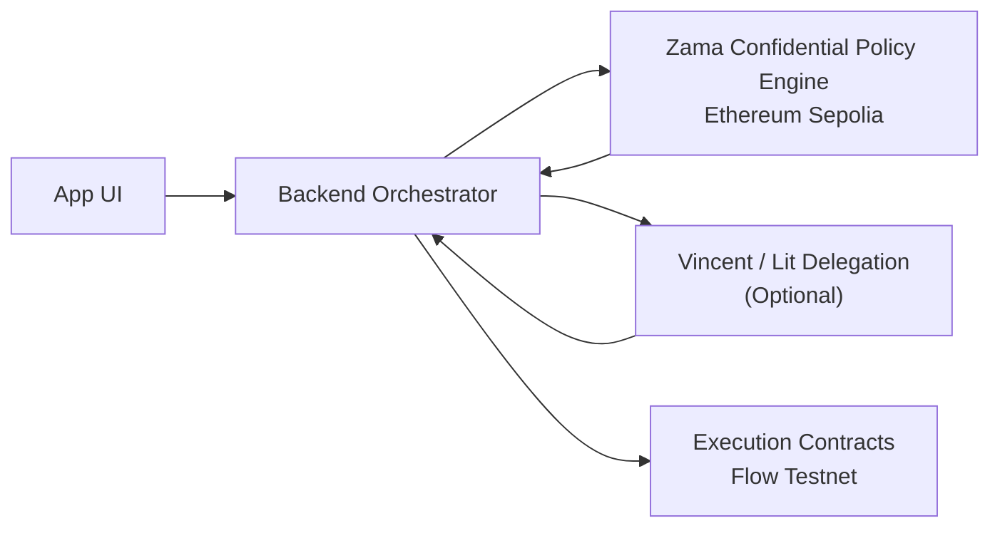

# Proof18

> Private policy. Controlled autonomy. Guardian-delegated AI execution.

Proof18 is positioned as **cross-chain confidential teen finance**:

- `Flow Testnet` handles user-facing financial execution
- `Ethereum Sepolia` handles confidential policy evaluation
- the backend orchestrates between them
- `Vincent / Lit` is the optional delegated-authorization layer

This is not presented as a single-chain atomic stack.

## Problem

400M+ Indian teens have no financial products designed for them.
Existing solutions are either too open or too restrictive.
Proof18 bridges that gap with **progressive financial freedom under guardian control**.

## Why This Matters

Teen finance is usually split between two bad models:

- full lockout, where teens cannot build healthy financial habits
- unsafe freedom, where money moves without clear supervision or policy

Proof18 takes the middle path:

- teens get guided autonomy instead of blanket denial
- guardians keep explicit control instead of hoping for good behavior
- private family rules stay private instead of becoming public chain metadata
- every action produces enough proof to audit what happened later

## Product Thesis

Proof18 is a guided financial autonomy system:

- teens can save, subscribe, and build trust over time
- guardians keep legal and financial control
- Clawrence explains actions in plain language
- private household rules are not exposed onchain

Canonical pitch language:

- `cross-chain confidential teen finance`
- `private policy, controlled autonomy, guardian-delegated AI execution`

## Why This Stack Is Non-Substitutable

Proof18 uses each partner for a different, user-visible job:

- `Flow Testnet` is the execution rail for savings, subscriptions, scheduling, and activity-linked finance
- `Zama on Ethereum Sepolia` keeps family policy confidential while still returning enforceable decisions
- `Vincent / Lit` gives Clawrence bounded authority instead of unrestricted agent custody
- the backend turns these into one coherent consumer product instead of exposing cross-chain complexity to the user

Removing any one layer weakens the product:

- without Flow, the product loses the consumer-finance execution rail
- without Zama, household rules become transparent or move offchain with weaker guarantees
- without Vincent / Lit, the agent story becomes less controlled and less auditable
- without the backend coordinator, the experience collapses into sponsor demos instead of a product

## Architecture



## Current Repo Reality

The current codebase still contains legacy Lit PKP and Storacha-oriented demo plumbing. That remains useful for local verification and appendix evidence, but it is **not** the primary sponsor-facing architecture story anymore.

Sponsor priority is:

1. `Fresh Code`
2. `Flow`
3. `Zama`
4. `Lit only if Vincent-powered delegation is live and demoable`

Storacha is intentionally removed from the main pitch and core track strategy. It remains a supporting evidence layer only.

## Live Contract Links

Execution rail on Flow Testnet:

- Access: [0x8cad59dE925c58303cbf01710415B919A7DfC931](https://evm-testnet.flowscan.io/address/0x8cad59dE925c58303cbf01710415B919A7DfC931)
- Vault: [0x8D44daddE8Cb5a128171e0B7F725D19Ea0EE030A](https://evm-testnet.flowscan.io/address/0x8D44daddE8Cb5a128171e0B7F725D19Ea0EE030A)
- Scheduler: [0x0dDB51caD015a7298E96977D0c32376A95Da931D](https://evm-testnet.flowscan.io/address/0x0dDB51caD015a7298E96977D0c32376A95Da931D)
- Passport: [0x5Abf416AC64CD93eEb69d46bcB0d81CD484451Fa](https://evm-testnet.flowscan.io/address/0x5Abf416AC64CD93eEb69d46bcB0d81CD484451Fa)

Confidential policy engine on Ethereum Sepolia:

- Policy: [0x30DBe01aF2df9c8848D0953aAeC1583733d79CA3](https://sepolia.etherscan.io/address/0x30DBe01aF2df9c8848D0953aAeC1583733d79CA3)

Delegated execution boundary:

- Safe executor Lit Action CID: `QmfK2J7V46w5KYjEbfc4ArcTgoRa2TaC1BAJPr17twPrhT`

## Setup

1. Copy `.env.example` to `.env.local` and fill all non-placeholder values.
2. Set `DEMO_STRICT_MODE=true`.
3. Ensure all contract addresses are non-zero in `deployments.json` and/or env vars.
4. Run:

```bash
npm run bootstrap
```

This runs `npm ci` plus strict preflight checks for the repo's currently wired integrations and execution environment.

## Verification

```bash
npm run verify
npm run hardhat:test
npm run build
npm run preflight
```

`npm run verify` runs the local health gate: Hardhat tests, TypeScript typecheck, and Next.js build.

## Core Demo Flows

1. Guardian + teen onboarding
2. Family onboarding bootstrap
3. Confidential policy set + evaluate
4. Savings execution on Flow
5. Subscription request, approval, and Flow execution
6. Passport progression and activity review

## Demo Narrative

The demo should only center two loops:

1. Savings:
   teen intent -> Clawrence explanation -> Zama evaluation on Sepolia -> Vincent / Lit delegated execution -> Flow execution
2. Subscription:
   teen request -> Zama private classification -> guardian approval when required -> Vincent / Lit bounded execution -> Flow funding + scheduling

Everything else is support material.

## Track Mapping

- `Fresh Code`: new product, complete story, live integrations, venture potential
- `Flow`: consumer finance UX, recurring execution, real explorer links
- `Zama`: confidential family policy, selective visibility, privacy with enforcement
- `Lit`: delegated authorization only if live Vincent proof is available before submission lock

Secondary alignment only after those are frozen:

- `Crypto`
- `AI & Robotics`
- `Community Vote`

## Demo Persistence

- `data/approvals.json`, `data/receipts.json`, and `data/families.json` are demo-only persistence layers
- they are not production databases
- legacy receipt storage remains in the repo as appendix evidence, but it is not treated as a core architectural pillar in the current submission framing
