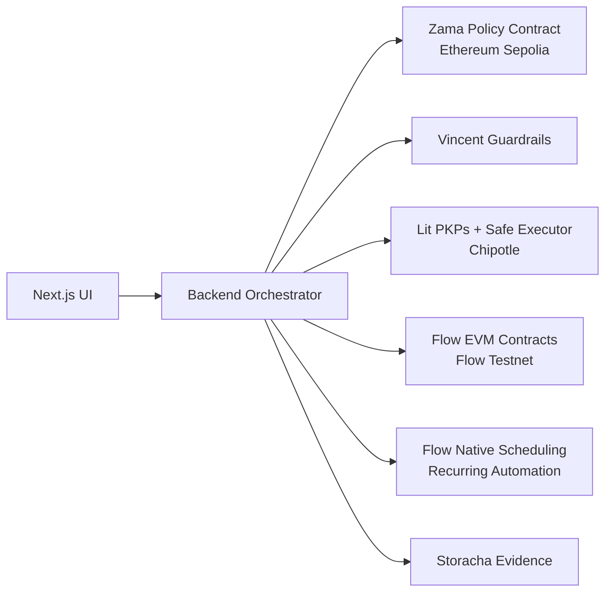

# Proof18

Proof18 is a **consumer DeFi app built for Flow** and designed for **PL Genesis: Frontiers of Collaboration**.

- **Flow EVM Testnet (545)** handles money movement and user-visible execution.
- **Flow-native scheduling** is the target automation layer for recurring actions, with the Solidity scheduler kept as a labeled fallback.
- **Ethereum Sepolia** hosts the **Zama** confidential policy engine.
- **Lit Chipotle** provides bounded delegated execution for Clawrence.
- **Vincent** is the optional guardrail layer for AI-executor policy checks.
- **Storacha** stores receipts and evidence, but is not a core execution dependency.

## Product Thesis

Proof18 gives teens guided financial autonomy while preserving guardian control:

- guardians set private household rules
- teens build trust through recurring actions
- Clawrence explains every step in plain language
- Flow handles the consumer finance experience
- the chain reveals outcomes, not the private household rulebook

## Architecture



## Core Demo Flows

### 1. Savings GREEN Path

1. Teen requests a savings action.
2. Clawrence explains the action.
3. Zama evaluates the confidential family rule on Sepolia.
4. Vincent guardrails check whether the executor is allowed to proceed.
5. Lit safe executor decides whether signing is permitted.
6. Flow executes the savings deposit.
7. Passport updates and an evidence receipt is stored.

### 2. Subscription Approval Path

1. Teen requests a subscription.
2. Zama returns `YELLOW` or `RED`.
3. Guardian reviews and approves.
4. Lit safe executor signs only after approval.
5. Flow funds the reserve and creates the recurring schedule.
6. Passport updates and an evidence receipt is stored.

## Submission Strategy

Primary competition track:

- **Fresh Code**

Primary sponsor target:

- **Flow**

Secondary sponsor targets:

- **Zama**
- **Lit / Vincent**, but only if the delegated execution proof is fully demoable.

## Runtime Truth Rules

The app intentionally avoids overclaiming:

- If Zama falls back from encrypted decryption, the result is labeled `heuristic`.
- If Vincent is not configured, the UI says `local-only`.
- If Flow native scheduling is not configured, recurring automation is labeled `evm-manual`.
- If Lit permissions cannot be fetched live, the proof page says so explicitly.
- Storacha is presented as an evidence layer, not a settlement or policy layer.

## Important Pages

- `/teen`
- `/guardian`
- `/auth/proof`

The proof page is the judge-facing trust surface. It shows:

- Flow wallet mode and gas mode
- Flow scheduler backend and native feature readiness
- Zama decision layer
- Vincent mode
- Lit safe executor CID
- chain responsibility split
- family onboarding proof when available

## Scripts

```bash
npm run dev
npm run build
npm run typecheck
npm run preflight
npm run hardhat:test
npm run hardhat:deploy:flow
npm run hardhat:deploy:policy
npm run pin:lit-action
```

## Environment

Required for strict demo mode:

- `NEXT_PUBLIC_ACCESS_CONTRACT`
- `NEXT_PUBLIC_VAULT_CONTRACT`
- `NEXT_PUBLIC_SCHEDULER_CONTRACT`
- `NEXT_PUBLIC_PASSPORT_CONTRACT`
- `NEXT_PUBLIC_POLICY_CONTRACT`
- `SAFE_EXECUTOR_CID`
- `STORACHA_KEY`
- `STORACHA_PROOF`
- `LIT_MINTING_KEY`
- `ZAMA_EVALUATOR_PRIVATE_KEY` or `ZAMA_PRIVATE_KEY`
- `FLOW_TESTNET_PRIVATE_KEY` or `DEPLOYER_PRIVATE_KEY`

Optional but recommended:

- `VINCENT_API_KEY`
- `GAS_FREE_RPC_URL`
- `SUBSCRIPTION_RECIPIENT_ADDRESS`

## Verification

Run these before demo or submission:

```bash
npm run typecheck
npm run build
npm run preflight
npx hardhat test test/Proof18.test.ts
npx hardhat test test/Integration.test.ts
```

## Honest Sponsor Fit

### Flow

- consumer finance UX on Flow
- Solidity contracts on Flow EVM for balances, passport state, and guardian-governed execution
- walletless onboarding and sponsored gas when configured
- recurring automation framed around Flow-native scheduling, with explicit fallback labeling

### Zama

- encrypted family thresholds on Sepolia
- public classification without exposing private values
- guardian-only private review path

### Lit / Vincent

- Clawrence is bounded by a Lit safe executor CID
- Vincent mode is shown as `live` or `local-only`
- permission proof is displayed on `/auth/proof`

## Current Repo Status

As of the current implementation:

- contract tests pass
- integration tests pass
- typecheck passes
- production build passes
- preflight passes

The remaining hackathon work is primarily Flow sponsor-proof hardening and demo polish, not basic app rescue.
